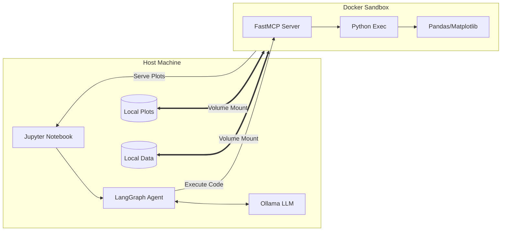

# LLM Data Analysis Agent with Secure Docker Sandbox (MCP)

This project implements a sophisticated Data Analysis Agent that uses a Large Language Model (LLM) to perform data processing, statistical analysis, and visualization within a secure, containerized Python sandbox.

The system leverages the **Model Context Protocol (MCP)** to bridge the LLM with a dedicated execution environment, ensuring that code execution is isolated and safe.

## 🚀 Features

- **Secure Sandbox**: Executes Python code inside a Docker container, protecting the host system.
- **LLM Integration**: Uses `llama3.1:70b` via Ollama for high-quality reasoning and tool calling.
- **Automated Data Analysis**: The agent can load CSV data, perform calculations, and generate insights.
- **Visualization**: Automatically generates plots and serves them via an HTTP endpoint for display in the notebook.
- **MCP Architecture**: Uses `FastMCP` to define tools and `langchain` / `langgraph` for agent orchestration.

## 🏗️ Architecture

1.  **User Interface**: Jupyter Notebook ([data_analysis_with_llm.ipynb](data_analysis_with_llm.ipynb)).
2.  **Agent**: LangGraph-based ReAct agent using `ChatOllama`.
3.  **Tool**: `sandbox_python_exec` which communicates with the MCP server.
4.  **MCP Server**: A Python service ([server.py](server.py)) running inside Docker.
5.  **Sandbox**: Docker container providing an isolated environment with `pandas`, `numpy`, and `matplotlib`.



## 📋 Prerequisites

- **Docker**: Installed and running.
- **Ollama**: Installed and running locally.
- **Python 3.10+**: For running the notebook and agent.
- **LLM Model**: Pull the required model:
  ```bash
  ollama pull llama3.1:70b
  ```

## 🛠️ Setup & Usage

### 1. Build the Sandbox Image

The sandbox environment is defined in the [Dockerfile](Dockerfile). Build it using:

```bash
docker build -t mcp-data-sandbox:2025 .
```

### 2. Run the Sandbox Container

The notebook handles starting the container, but you can also run it manually:

```bash
docker run -d --name mcp-sandbox -p 8765:8765 \
  -v "$(pwd)/local-data:/app/data" \
  -v "$(pwd)/local-plots:/app/plots" \
  mcp-data-sandbox:2025
```

### 3. Install Python Dependencies

Create a virtual environment and install the required packages:

```bash
pip install -r requirements.txt
pip install docker requests langchain langchain-community langchain-ollama langgraph nest-asyncio fastmcp
```

### 4. Run the Notebook

Open [data_analysis_with_llm.ipynb](data_analysis_with_llm.ipynb) and execute the cells. The notebook will:

- Upload [synthetic_sales_data.csv](synthetic_sales_data.csv) to the container.
- Initialize the agent.
- Send a complex data analysis request to the agent.
- Display the resulting text and plots.

## 📂 Project Structure

- [data_analysis_with_llm.ipynb](data_analysis_with_llm.ipynb): Main entry point and agent logic.
- [server.py](server.py): MCP server implementation for the sandbox.
- [Dockerfile](Dockerfile): Container definition for the execution environment.
- [requirements.txt](requirements.txt): Dependencies for the sandbox environment.
- [synthetic_sales_data.csv](synthetic_sales_data.csv): Sample dataset for testing.
- `local-data/`: Local directory mapped to `/app/data` in the container.
- `local-plots/`: Local directory mapped to `/app/plots` in the container.

## 🔒 Security Note

The sandbox uses a non-root user and restricted built-ins within the `exec()` environment. However, for production use, further hardening (like using `gVisor` or more restrictive `seccomp` profiles) is recommended.

---

_Created as part of the Advanced Python Programming experiments._
